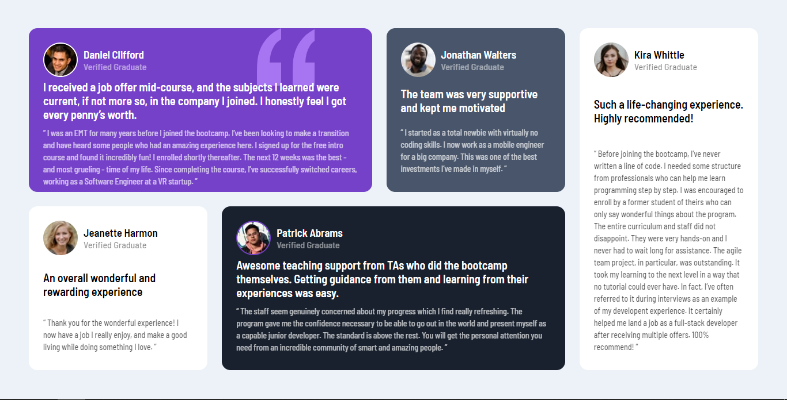

# Frontend Mentor - Testimonials grid section solution

This is a solution to the [Testimonials grid section challenge on Frontend Mentor](https://www.frontendmentor.io/challenges/testimonials-grid-section-Nnw6J7Un7). Frontend Mentor challenges help you improve your coding skills by building realistic projects.

## Overview

### The challenge

Users should be able to:

- View the optimal layout for the site depending on their phones and laptops screen size

### Screenshot

## My process

### Built with

- Semantic HTML5 markup
- CSS custom properties
- Flexbox
- CSS Grid

## Author

- github - [Hakiki Ahmed Djeber](https://github.com/HakikiAhmedDjeber)
- Frontend Mentor - [@Hakiki_Ahmed_Djeber](https://www.frontendmentor.io/profile/HakikiAhmedDjeber)
